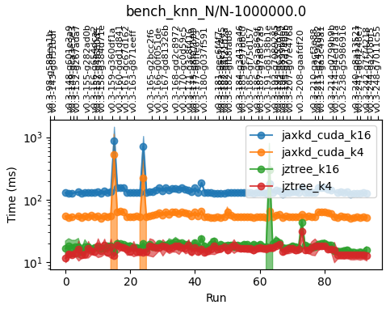

# Developer Guide
This guide provides information on the structure of the **jz-tree** repository, on the handling of
lower-level CUDA modules and on the unit-testing system. It is recommended that you read this
if you want to modify the code yourself.

## Code structure
If you execute `tree -L 2` from the main directory, you will see something like the following
```
├── CMakeLists.txt
├── ...
├── build
│   ├── ...
├── checks
│   ├── benchmarks
│   ├── ...
│   ├── hello_world.py
│   ├── ...
│   └── tests
├── docs
│   ├── ...
├── notebooks
│   ├── multi_gpu_guide.ipynb
│   ├── quickstart.ipynb
├── pyproject.toml
├── src
│   ├── jztree
│   ├── jztree_cuda
│   └── jztree_utils
└── ...
```
* `CMakeLists.txt` and the `pyproject.toml` define how the CUDA code gets compiled. 
* `checks` is a directory that contains unit-tests, benchmarks and some other scripts used to evaluate the code
* `docs` contains the files needed to build this documentation -- generated with [Sphinx](https://www.sphinx-doc.org/en/master/).
* `notebooks` contains some jupyter notebooks that explain usage of the repo.
* `build` contains files that are created when building the project.
* `src` contains three separate directories:
    - jztree: the main python module
    - jztree_cuda: the cuda/ffi kernels
    - jztree_utils: Some data and tools that help with testing the code.

## Python modules
The `src/jztree` directory has the following structure:

```bash
src
├── jztree
│   ├── __init__.py
│   ├── _version.py
│   ├── comm.py
│   ├── config.py
│   ├── data.py
│   ├── fof.py
│   ├── jax_ext.py
│   ├── knn.py
│   ├── stats.py
│   ├── tools.py
│   └── tree.py
```

You can find some of the python modules documented in the [API reference](api.rst). However, there
are additional files that deal with lower level details that are not included:

* `comm.py`: Holds some communication helper functions with more convenient interfaces than jax's built-in methods
* `config.py`: Holds configuration dataclasses that are used throughout the code to control lower-level details
* `data.py`: Holds dataclasses (such as particles) and some convenience functions to access / manipulate them.
* `fof.py`: The implementation of the friends-of-friends clustering.
* `jax_ext.py`: Holds a few functions that extent some standard jax functions with additional features.
* `knn.py`: The implementation of the k-nearest neighbour search.
* `stats.py`: Defines a context-manager that may be used to infer e.g. how much of the allocated spaces were used-
* `tools.py`: Some frequently used helper functions.
* `tree.py`: Defines z-sorting, tree-building and regularization.

## CUDA kernels and automatic FFI generation

The `src/jztree_cuda` directory has the following structure:

```bash
src
├── jztree_cuda
│   ├── _generate_ffi.py
│   ├── common
│   │   ├── data.cuh
│   │   ├── iterators.cuh
│   │   └── math.cuh
│   ├── fof.cuh
│   ├── generated
│   │   ├── ffi_fof.cu
│   │   ├── ffi_knn.cu
│   │   ├── ffi_sort.cu
│   │   ├── ffi_tools.cu
│   │   └── ffi_tree.cu
│   ├── knn.cuh
│   ├── sort.cuh
│   ├── tools.cuh
│   └── tree.cuh
```

Importantly, the directory `generated` contains [foreign function interface](https://docs.jax.dev/en/latest/ffi.html) (FFI) bindings that
are automatically generated. So I suggest not to modify these file manually.

Let us have a look at an example to see how this works. In the file `tree.cuh` you can find a
kernel with the following signature:
```CUDA
template<int dim, typename tvec>
__global__ void GetNodeGeometry(
    const Vec<dim,tvec>* pos,
    const int* lbound,
    const int* rbound,
    const int *nnodes,
    int32_t* level,
    Vec<dim,tvec>* center,
    Vec<dim,tvec>* extent,
    const int size_nodes,
    const int size_part,
    const int lvl_invalid,
    const uint32_t mode_flags,
    const bool upper_extent
) {
    //...
}
```

This kernel computes properties of nodes, given knowledge of their first and last particle (indicated
by `lbound` and `rbound`). All input arrays (`pos`, `lbound`, `rbound`, `nnodes`)
are pointers with the `const` keyword, whereas output arrays (`level`, `center` and `extent`) are 
pointers without `const`. Static parameters are `const`, but not pointers. Finally, there
are template parameters `dim` and `tvec` -- indicating the dimension and the data-type of vector
data-types (e.g. `float` or `double`).

Ideally, we'd want to directly call this kernel from python/jax, but this is not possible. Instead
we need to interface with jax's FFI -- which involves a lot of boiler plate code. This gets especially
challenging with the requirement that we need to instantiate all the template parameter combinations.
Therefore, I have written a little tool [jax_ffi_gen](https://github.com/jstuecker/jax_ffi_gen) that
auto-generates the FFI from the function signature. Let's have a look at the file
`jztree_cuda/_generate_ffi.py`:

```python
from jax_ffi_gen import parse, generator as gen
# ...
functions = parse.get_functions_from_file(
    str(HERE / "tree.cuh"),
    names=["FlagLeafBoundaries", "FindNodeBoundaries", "GetNodeGeometry", "CenterOfMass",
           "GetBoundaryExtendPerLevel", "FlagInteractingNodes"],
    only_kernels=False
)

# ...

add_dim_dtype_templates(functions["GetNodeGeometry"], "pos")
functions["GetNodeGeometry"].par["size_nodes"].expression = "lbound.element_count()"
functions["GetNodeGeometry"].par["size_part"].expression = "pos.dimensions()[0]"
functions["GetNodeGeometry"].grid_size_expression = "div_ceil(size_nodes, block_size)"

# ...

gen.generate_ffi_module_file(
    output_file = str(HERE / "generated/ffi_tree.cu"), 
    functions = functions, 
    includes = default_includes + ["../tree.cuh"]
)
```

You can see that the code-generation involves three steps:

(1): We find all the functions of interest by parsing the code of `tree.cuh` (this internally uses 
[tree-sitter](https://tree-sitter.github.io/tree-sitter/)).

(2): We customize some aspects of the function. For example, we can infer the parameter "size_nodes"
from the element count of one of jax's array. Further, we need to define template instances. To 
avoid repetition, it is done with the `add_dim_dtype_templates` function -- which does 
something like this
```python
functions["GetNodeGeometry"].template_par["dim"].instances = (2,3,4,5,6,7,8,9,10)
functions["GetNodeGeometry"].template_par["dim"].expression = "pos.dimensions()[1]"
```
Further, we define a "grid_size_expression" which defines the kernel launch. (If you skip this,
you may also define the "grid_size" parameter directly from the python side.)

(3): We call `gen.generate_ffi_module_file` to auto-generate the FFI code. E.g. if you delete
`generated/ffi_tree.cu` and run the script, it shold reappear. This generation step uses a 
[JINJA](https://jinja.palletsprojects.com/en/stable/) template setup internally.

If you have a look at the generated file, you will find something like this
```CUDA
ffi::Error GetNodeGeometryFFIHost(
    cudaStream_t stream,
    ffi::AnyBuffer pos,
    ffi::AnyBuffer lbound,
    ffi::AnyBuffer rbound,
    ffi::AnyBuffer nnodes,
    ffi::Result<ffi::AnyBuffer> level,
    ffi::Result<ffi::AnyBuffer> center,
    ffi::Result<ffi::AnyBuffer> extent,
    int lvl_invalid,
    uint32_t mode_flags,
    bool upper_extent,
    size_t block_size
) {
    // ...
    // a lot of code for instancing all template parameter combinations
    // ...

    cudaLaunchKernel(
        instance,
        gridDim,
        blockDim,
        args,
        smem,
        stream
    );

    // ...
}

XLA_FFI_DEFINE_HANDLER_SYMBOL(
    GetNodeGeometryFFI, GetNodeGeometryFFIHost,
    ffi::Ffi::Bind()
        .Ctx<ffi::PlatformStream<cudaStream_t>>()
        .Arg<ffi::AnyBuffer>() // pos
        .Arg<ffi::AnyBuffer>() // lbound
        .Arg<ffi::AnyBuffer>() // rbound
        .Arg<ffi::AnyBuffer>() // nnodes
        .Ret<ffi::AnyBuffer>() // level
        .Ret<ffi::AnyBuffer>() // center
        .Ret<ffi::AnyBuffer>() // extent
        .Attr<int>("lvl_invalid")
        .Attr<uint32_t>("mode_flags")
        .Attr<bool>("upper_extent")
        .Attr<size_t>("block_size"),
    {xla::ffi::Traits::kCmdBufferCompatible}
);

// ...

NB_MODULE(ffi_tree, m) {
    // ...
    m.def("GetNodeGeometry", []() { return EncapsulateFfiCall(&GetNodeGeometryFFI); });
    // ...
}
```
Feel free to have a look at the full source-code to appreciate the amount of coding work that we 
are saving with this. (And more importantly the amount of interfacing bugs that we avoid!)

Finally, let us see, how we call this function from the python side.

```python
#...
from jztree_cuda import ffi_tree, ffi_sort
#...

jax.ffi.register_ffi_target("GetNodeGeometry", ffi_tree.GetNodeGeometry(), platform="CUDA")

#...
def get_node_geometry(posz: jax.Array, lbound: jax.Array, rbound: jax.Array, 
                      num: jax.Array | None = None, block_size: int = 64, 
                      result: str = "lvl_cent_ext", upper_extent: bool = False
                      ) -> Tuple[jax.Array, jax.Array, jax.Array]:

    # define mode_flags ...

    if num is None:
        num = jnp.array(len(lbound))

    size = lbound.shape[0]

    out_types = (
        jax.ShapeDtypeStruct((size,), jnp.int32),
        jax.ShapeDtypeStruct((size, posz.shape[-1]), posz.dtype),
        jax.ShapeDtypeStruct((size, posz.shape[-1]), posz.dtype)
    )

    lvl, cent, ext = jax.ffi.ffi_call("GetNodeGeometry", out_types)(
        posz, lbound, rbound, num, block_size=np.uint64(block_size),
        lvl_invalid=np.int32(-2000), mode_flags=np.uint32(mode_flags), upper_extent=upper_extent
    )
    
    # ...
```
(I have simplified this function a bit.) If you compare with the signature of the CUDA kernel,
you see that the interface is mostly identical: For every `const *` we have one input array,
for every `*`, we have one output array and for every parameter (except the ones that we hard-coded),
we pass a keyword argument with the same name. The only additional parameter is `block_size` which
defines how many threads are dispatched per block and it is generally considered an important-to-test
performance parameter (good choices are generally multiples of 32 or 64, depending on the kernel.)

So the auto-generation allows us to work "almost" as if we were directly invoking the kernel from
jax. It's understandable if this whole setup feels a bit overwhelming, but it gets easier once
trying it out a bit. And it is well worth it if you consider that it allows you to compute at
the fastest possible speed. I have set up a minimal setup in 
[this repository](https://github.com/jstuecker/jax-ffi-example) if you'd like to play around
within a safe testing ground.

## Unit tests and benchmarks
**jz-tree** is a well tested and benchmarked code. If you check `tree -L 2` from `src/checks` 
you find the following structure:

```bash
├── ...
├── benchmarks
│   ├── .results
│   ├── bench_comm.py
│   ├── bench_distr_fof.py
│   ├── bench_distr_knn.py
│   ├── bench_distr_tree.py
│   ├── bench_fof.py
│   ├── bench_knn.py
│   ├── bench_ops.py
│   └── bench_tree.py
├── conftest.py
├── data
│   ...
├── ...
├── profiling
│   ├── ...
├── pytest.ini
└── tests
    ├── test_distr_fof.py
    ├── test_distr_knn.py
    ├── test_distr_tree.py
    ├── test_fof.py
    ├── test_knn.py
    └── test_tree.py
```

The directory `tests` contains a couple of unit tests and the `benchmarks` directory contains
benchmarks -- all of which can be run with `pytest`. Tests and benchmarks that contain `distr`
are testing multi-GPU scenarios and should be run with multiple devices available.

If you want to be able to run all of these, you need to install additional requirements:
* pytest
* [pytest-jax-bench](https://github.com/jstuecker/pytest-jax-bench) -- this is a little pytest
plugin that I have created to simplify defining repeatable benchmarks for jax programs. It writes
benchmark results into `benchmarks/.results` and also creates plots that allow to track the
performance of different functions across commits. For example, the following is the performance history
of `bench_knn.py::bench_knn_N[1e6]` on my laptop. A large part of the variations comes from 
connecting a larger or smaller number of displays to my laptop, but you can believe me that I'd 
have noticed it if I ever made the code slower!


* [hfof](https://github.com/pec27/hfof) -- required in a single test that will be skipped if you
don't have it.
* [DISCO-DJ](https://github.com/cosmo-sims/DISCO-DJ) -- used in some tests on cosmological simulations.
If you don't have it, the corresponding tests will be skipped. Note that the private and public
interface of this code have slightly diverged and you may not be able to run tests with this
until the most recent changes become public.

Try out running some of the tests, e.g. from the `checks` directory do:
```bash
pytest --quick tests/test_knn.py
```
or 
```bash
pytest --quick benchmarks/bench_tree.py
```
The latter one giving an output like this:
```bash
Using single-host mode
======================================================== test session starts ========================================================
platform linux -- Python 3.12.11, pytest-8.4.2, pluggy-1.6.0
rootdir: /home/jens/repos/jz-tree/checks
configfile: pytest.ini
plugins: jax-bench-0.5.0, forked-1.6.0, regressions-2.8.3, datadir-1.8.0, anyio-4.11.0, jaxtyping-0.3.3
collected 7 items

benchmarks/bench_tree.py s.sss.s

================================================ Pytest Jax Benchmark (PTJB) results ================================================
                             Test                               C.Run       Tag        Compile(ms)      Jit-Run(ms)    Jit-Peak(MB)
benchmarks/bench_tree.py::bench_build_tree_hierarchy[1048576]  0->4   geom_centered  1191.8->1233.8  2.1->1.4+-1.1    18.8->18.8
benchmarks/bench_tree.py::bench_build_tree_hierarchy[1048576]  0->4   mass_centered  1109.6->1052.3  3.1->2.6+-0.6    20->20
benchmarks/bench_tree.py::bench_zsort[8388608]                 0->4   zsort          166.0->156.8    22.1->21.2+-1.7  264->264
All PTJB benchmarks plots saved to benchmarks/.results
=================================================== 2 passed, 5 skipped in 6.70s ====================================================
```
The `--quick` option skips a lot of tests/benchmarks that are slightly redundant (i.e. they address
the same question, but with different parameters). Of course, you can ommit it if you want to have a
full picture!

## Recommendations

So far **jz-tree** only contains the implementation of two algorithms, nearest neighbour search and
friends-of-friends. However, in principle the framework may be applied to a large class of other
algorithms that use dual treewalks. If you are interested in implementing another algorithm, I'd
recommend the following steps:

* First define a leaf-leaf interaction kernel. This one should be close to a brute-force approach,
but where the input data is grouped into leaves. 
* Try to follow the same traversal pattern that is used  in `knn.cuh` and `fof.cuh`. 
This will give you a well-coalescing memory access pattern which is very important for performance 
on GPU.
* You can create a simple setup by seeding a dense interaction list on the leaves 
(i.e. every leaf interacting with every other leaf) and evaluating your kernel.
* Set up some unit tests for it and make sure it gives correct results.
* Set up some benchmarks for small problems (with ~ 1e5 particles) this should already give you 
decent performance, but it probably doesn't scale well to large problem sizes.
* Next, define a node-node interaction kernel. Here, you have to consider the following questions:
    - Do you need to pre-calculate some additional information for your nodes?
    - Under which conditions can you discard interactions (prune)?
    - What data can you evaluate at the parent level and pass down directly to children?
* Follow the "dual tree walk" pattern that you can find in `knn._knn_dual_walk` and `fof._fof_dual_walk`.
* Benchmark and test against your brute-force implementation. If everything worked well, you may
now have one of the fastest possible implementations of your algorithm.

If you are planning to implement something like this or if you have some feature request, feel free to
contact me.