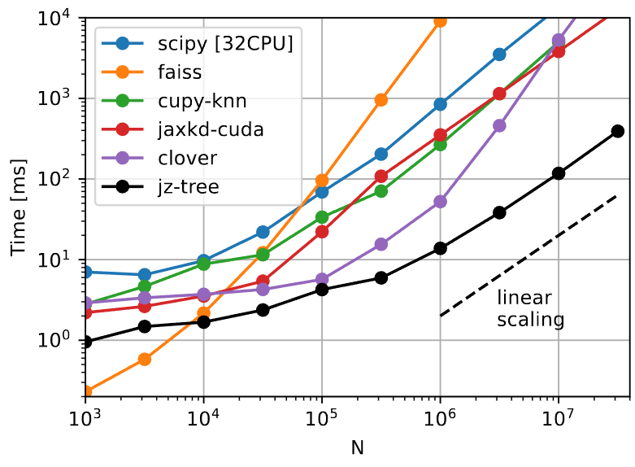

jz-tree documentation
=====================

Welcome to the documentation of jz-tree!

**jz-tree** offers a framwork for GPU-friendly implementations of tree algorithms in jax (with
a CUDA backend). Currently, only nearest neighbour search and friends-of-friends are implemented, but 
more may come in the future! As far as we know, **jz-tree** offers the fastest GPU 
implementation of these two algorithms at the time of writing. E.g. this is a benchmark of a
30-nearest neighbour search in three dimensions, run on a single NVIDIA-A100 GPU:

.. toctree::
   :maxdepth: 2
   :caption: Contents:

   installation.md
   quickstart.md
   multi_gpu_guide.md
   developer_guide.md
   api.rst