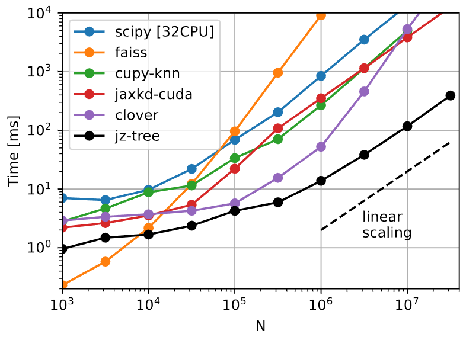

jz-tree documentation
=====================

Welcome to the documentation of jz-tree!

**jz-tree** offers a framwork for GPU-friendly implementations of tree algorithms in jax (with
a CUDA backend). Currently, nearest neighbour search and friends-of-friends are implemented, but 
more may come in the future! As far as we know, **jz-tree** offers the fastest GPU 
implementation of these two algorithms at the time of writing. For example, this is a benchmark of a
30-nearest neighbour search in three dimensions, run on a single NVIDIA-A100 GPU:

For additional details, also consider:

* The `code repository <https://github.com/jstuecker/jztree>`_
* The arXiv preprint article: `arXiv:2604.05885 <https://arxiv.org/abs/2604.05885>`_
* Jens Stücker's `personal homepage <https://jstuecker.github.io/>`_

Related projects
----------------

* `jz-fmm <https://jstuecker.github.io/jzfmm/>`_:
  a GPU-native fast multipole method built on jz-tree for fast and
  differentiable gravitational N-body simulations, with single- and multi-GPU
  support.
* `ztree-pca-normals <https://github.com/aullrich-pc6/ztree-pca-normals>`_:
  an independent, MIT-licensed CUDA implementation based on jz-tree for
  estimating point-cloud normals, without a JAX dependency. This may be useful
  for applications that need a standalone CUDA implementation.

.. toctree::
   :maxdepth: 2
   :caption: Contents:

   installation.md
   quickstart.md
   multi_gpu_guide.md
   developer_guide.md
   api.rst
   attribution.md
   changelog.md
